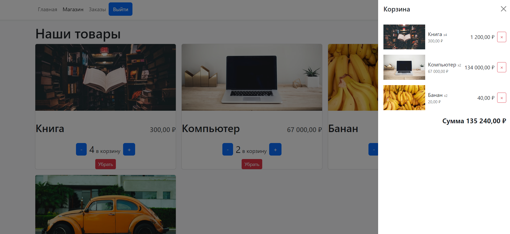
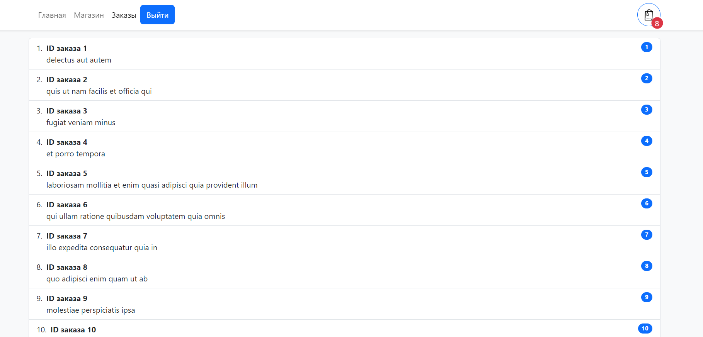
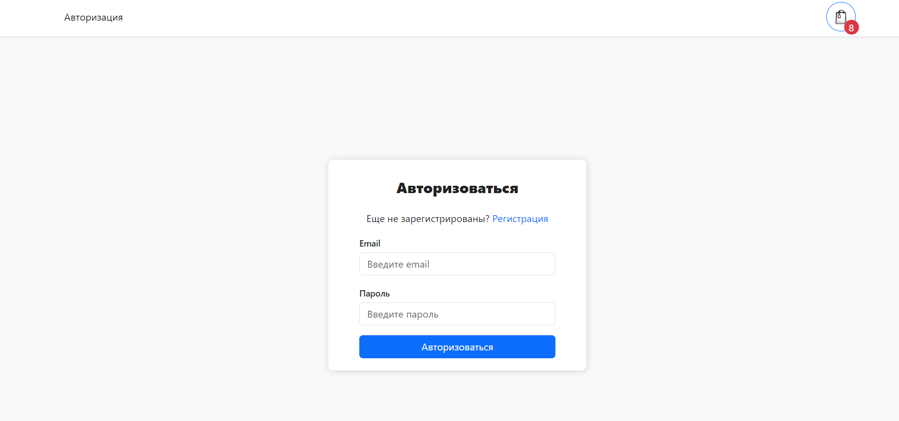

# Project Name: E-Commerce App##

## Introduction

Welcome to the README file for the E-Commerce App project. 
This project aims to provide users with a seamless online shopping experience, allowing them to register, 
log in, browse through a variety of items in the app shop, add items to their cart, and place orders.

## Technologies Used
The E-Commerce App has been developed using the following technologies:

React: A popular JavaScript library for building user interfaces.
TypeScript: A statically typed superset of JavaScript that enables better code quality and improved developer productivity.
Redux: A predictable state container for JavaScript apps, providing a central store for managing application state.
React-Bootstrap: A library of reusable UI components for React, helping to create responsive web interfaces with ease.

## Key Features
The E-Commerce App boasts the following key features:

#User Registration and Login

Users can create an account by registering with their email address and a secure password.
The login functionality ensures that only registered users can access their personalized account.

## App Shop
The app shop offers a wide range of items for users to browse and purchase.
Users can view detailed information and images of each item, helping them make informed buying decisions.
The search functionality allows users to find specific items based on keywords or categories.

## Cart Functionality
Users can add items to their cart, which serves as a temporary storage for their intended purchases.
The cart page displays a summary of all the items added, including their quantities and total price.
Users can update the quantities of items in the cart or remove items altogether.

## Order Management
Admin users have access to a dedicated page for managing orders placed by users.
The orders page provides a comprehensive overview of all orders, including their status and details.
Admins can update the status of orders, mark them as fulfilled, and provide tracking information if necessary.

## Installation
To run the E-Commerce App locally on your machine, follow these steps:

Clone the repository to your local machine.
Navigate to the project's root directory.
Install the necessary dependencies by running the command: npm install.
Start the development server with the command: npm start.
Open your web browser and access the app at http://localhost:3000.

### Conclusion
Thank you for your interest in the E-Commerce App project. 
